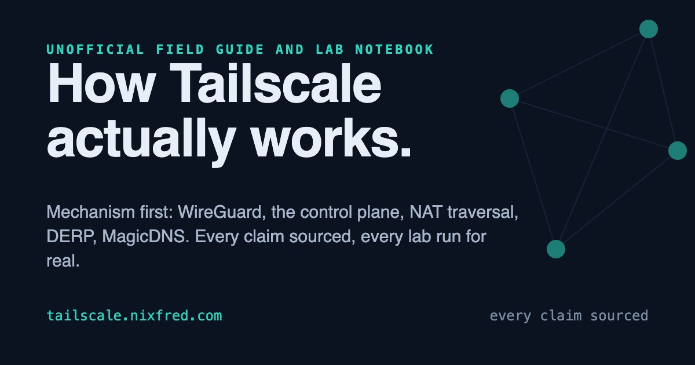
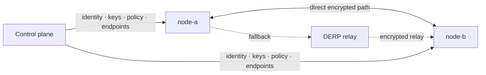
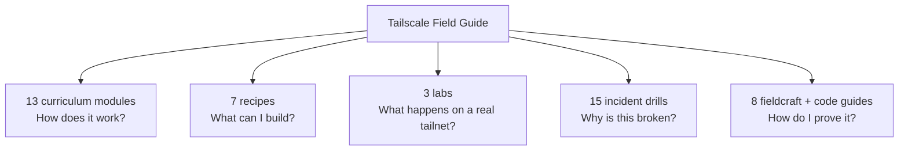
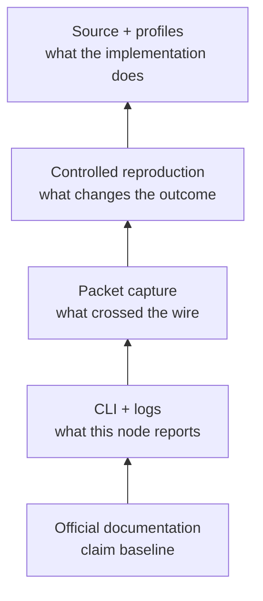
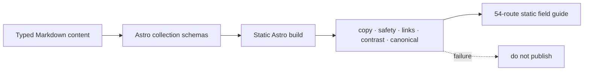

<div align="center">



# Tailscale Field Guide

### Mechanism first. Marketing never.

An unofficial field guide and lab notebook for understanding Tailscale from the WireGuard handshake up: control plane, NAT traversal, DERP, identity, policy, DNS, routing, operations, incidents, and source code.

[](https://astro.build)
[](#five-ways-into-the-mesh)
[](https://tailscale.nixfred.com/sources)

**[Read the field guide →](https://tailscale.nixfred.com)**

</div>

## How the mesh actually forms

Tailscale is not “a VPN server in the cloud.” The coordination plane distributes identity, keys, policy, DNS, and endpoint information. Devices then try to establish encrypted peer-to-peer WireGuard paths. DERP relays carry encrypted traffic only when direct connectivity cannot be established.



The curriculum follows that machinery layer by layer, showing the analogy, the mechanism, failure modes, on-wire evidence, and commands that prove what is happening.

## Five ways into the mesh



- **Curriculum:** orientation through WireGuard, coordination, NAT traversal, identity, policy, DNS, routing, services, platforms, operations, troubleshooting, and the codebase.
- **Recipes:** useful systems built once the mesh is trusted, including keyless SSH, policy as code, stable SaaS egress, and nodes born automatically.
- **Labs:** exercises run against a real multi-machine tailnet and published with the output they produced.
- **Drills:** escalation cases with evidence, hypothesis trees, investigation, root cause, and handoff packages.
- **Fieldcraft and code lab:** packet capture, reproduction, Go source reading, pprof, and incident communication.

## Evidence has a ladder



Every factual claim traces to an official source with a checked date. Deeper tracks teach how to move beyond documentation when a live incident demands stronger evidence. The public [sources ledger](https://tailscale.nixfred.com/sources) makes the provenance visible.

## Content is code with guardrails



The repository currently contains 13 modules, 7 recipes, 15 drills, 4 fieldcraft guides, 4 code-lab guides, and 3 labs. Each page includes at least two custom SVG diagrams, and diagram counts shown on the site are computed from real content at build time.

## Run locally

```bash
git clone https://github.com/nixfred/tailscale.nixfred.com.git
cd tailscale.nixfred.com
bun install
bun run dev
```

Production build:

```bash
bun run build
```

The included checks cover canonical URLs, contrast, copy constraints, safety language, source guardrails, and links.

## Repository map

```text
src/content/modules/   13-part curriculum
src/content/recipes/   systems worth building
src/content/labs/      tested tailnet exercises
src/content/drills/    incident case studies
src/content/guides/    fieldcraft and code lab
src/pages/             track indexes, entries, sources ledger
tests/                 build-time editorial and safety gates
docs/                  product decisions, risks, and factory compliance
```

## Independence and trademark note

This is an independent educational project, not official Tailscale documentation. The Tailscale name and logo belong to Tailscale Inc. and are used only to identify the product being documented.
